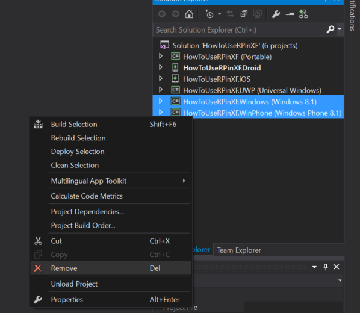
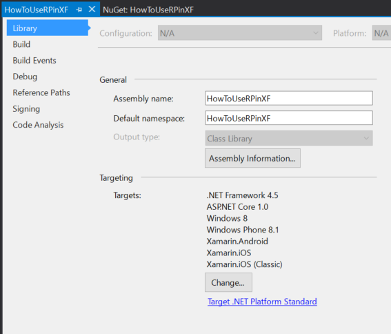
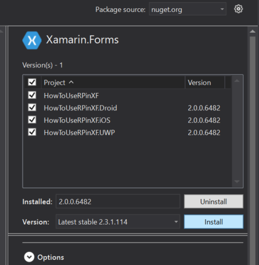

# How to use ReactiveProeprty in Xamarin.Forms

## Step1. Create project
Create Blank App (Xamarin.Forms Portable).

## Step2. Remove Windows and WinPhone project
ReactiveProeprty 3.0 is not support Windows8.1 and Windows Phone 8.1.
Remove Windows and WinPhone project at solution.



## Step3. Upgrade to .NET Standard

Remove all nuget reference at portable library project.


Open properties page at portable library project.
Click `Target .NET Platform Standard` at `Library` tab.



And change to .NET Standard 1.2.

Add imports at project.json.

```javascript
{
  "supports": {},
  "dependencies": {
    "Microsoft.NETCore.Portable.Compatibility": "1.0.1",
    "NETStandard.Library": "1.6.0"
  },
  "frameworks": {
    "netstandard1.2": {
      "imports": "portable-uap+net45"
    }
  }
}
```
## Step4. Upgrade Micfosoft.NETCore.UniversalWindowsPlatform

Open `Manage nuget package for solution...`.
And upgrade Micfosoft.NETCore.UniversalWindowsPlatform package to v5.2.2(or higher).

## Step5. Upgrade Xamarin.Forms

Upgrade to Latest stable version Xamarin.Forms all project.



## Step6. Install ReactiveProperty all project

Install ReactiveProeprty v3.x from NuGet.


## Step7. Remove reference at Droid project

Remove `System.Runtime.InteropService.WindowsRuntime` reference at Droid project.(IMPORTANT!)

## Step8. Write your code

Write your code!!
