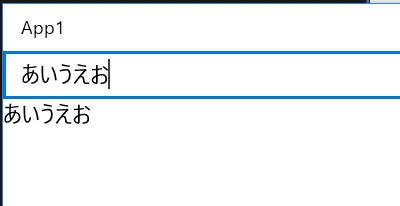
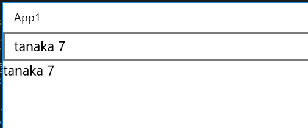
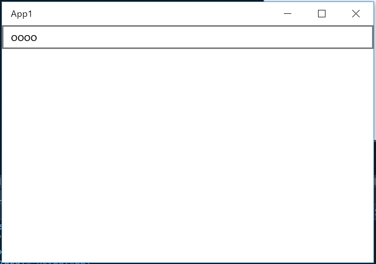
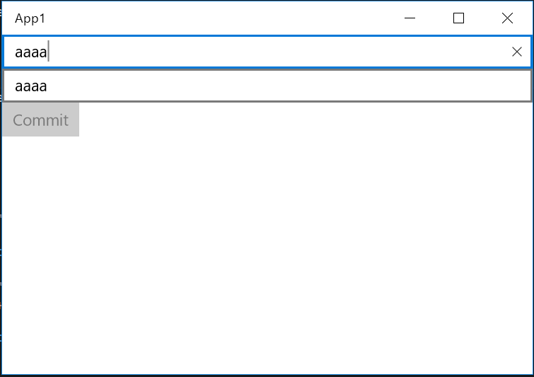
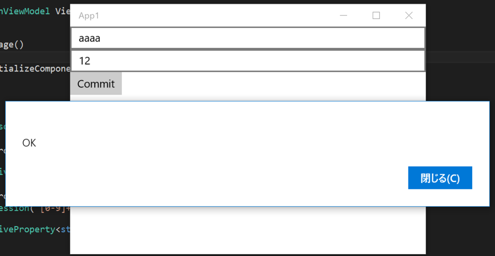

[Japanese](README-ja.md)

ReactiveProperty
================


ReactiveProperty is MVVM and Asynchronous Extensions for Reactive Extensions.
Target Framework is .NET 4.0, .NET 4.5, .NET 4.6, Windows Phone 8.0/8.1, Windows store app 8.1, UWP, Xamarin.iOS, Xamarin.Android.

## Release note

[Release note](ReleaseNote.md)

## Features

ReactiveProperty is MVVM support library. ReactiveProperty has functions follows.

- ReactiveProeprty class.
- ReactiveCommand class.
- ReactiveCollection class.
- ReadOnlyReactiveCollection class.
- Convert to IObservable from INotifyPropertyChanged/INotifyCollectionChanged.
- Many IObservable factory methods.
- Notifier classes.
- IFilteredReadOnlyObservableCollection interface.

## ReactiveProperty class.
This is core class in this library. ReactiveProperty can define notify property very easy.
But, little longer more than normal property when XAML data binding.

For example, define Name property in ViewModel follows.

```cs
public class PersonViewModel
{
    public ReactiveProperty<string> Name { get; } = new ReactiveProperty<string>();
}
```

Set and get value to Value property from ReactiveProperty class.
So, It implements INotifyPropertyChanged interface.
It can use follows.

```cs
// Must set Scheduler in Console Application
ReactivePropertyScheduler.SetDefault(CurrentThreadScheduler.Default);

var vm = new PersonViewModel();
vm.Name.PropertyChanged += (_, __) => Console.WriteLine($"Name changed {vm.Name.Value}");

vm.Name.Value = "tanaka";
Console.ReadKey();
vm.Name.Value = "kimura";
Console.ReadKey();
```

Output is follows.

```
Name changed tanaka
Name changed kimura
```

## How to use XAML platform

ReactiveProperty can use XAML platform application.
It can use Universal Windows Platform, WPF and Xamarin.
Here, I would like to explain the use of in the UWP.

Binding to MainPage with previous PersonViewModel.
Write code behind.

```cs
public sealed partial class MainPage : Page
{
    public PersonViewModel ViewModel { get; } = new PersonViewModel();

    public MainPage()
    {
        this.InitializeComponent();
    }
}
```

MUST use Value property in BindingPath.

```xml
<Page x:Class="App1.MainPage"
      xmlns="http://schemas.microsoft.com/winfx/2006/xaml/presentation"
      xmlns:x="http://schemas.microsoft.com/winfx/2006/xaml"
      xmlns:local="using:App1"
      xmlns:d="http://schemas.microsoft.com/expression/blend/2008"
      xmlns:mc="http://schemas.openxmlformats.org/markup-compatibility/2006"
      mc:Ignorable="d">

    <StackPanel Background="{ThemeResource ApplicationPageBackgroundThemeBrush}">
        <TextBox Text="{x:Bind ViewModel.Name.Value, Mode=TwoWay}" />
        <TextBlock Text="{x:Bind ViewModel.Name.Value, Mode=OneWay}" />
    </StackPanel>
</Page>
```

When execute this program, synchronize TextBox and TextBlock.



## ReactiveProperty can generate from IObservable

ReactiveProperty provide to easy way notify property. It doesn't extend ViewModel base class.
Otherwise ReactiveProperty can create from IObservable interface.

Call ToReactiveProperty extension method to IObservable interface.
ReactiveProperty will store value when pushed value from IObservable.

For example follows.

```cs
public class PersonViewModel
{
    public ReactiveProperty<string> Name { get; } = Observable.Interval(TimeSpan.FromSeconds(1))
        .Select(x => $"tanaka {x}")
        .ToReactiveProperty();
}
```

Update the value at one-second intervals.



## ReactiveProperty is IObservable

You understand that ReactiveProperty can generate from IObservable.
Otherwise ReactiveProperty is IObservable.
ReactiveProperty can generate from ReactiveProperty.


For example follows.

```cs
public class PersonViewModel
{
    public ReactiveProperty<string> Input { get; } = new ReactiveProperty<string>("");

    public ReactiveProperty<string> Output { get; }

    public PersonViewModel()
    {
        this.Output = this.Input
            .Delay(TimeSpan.FromSeconds(1))
            .Select(x => x.ToUpper())
            .ToReactiveProperty();
    }
}
```

XAML is fllows.

```xml
<Page x:Class="App1.MainPage"
      xmlns="http://schemas.microsoft.com/winfx/2006/xaml/presentation"
      xmlns:x="http://schemas.microsoft.com/winfx/2006/xaml"
      xmlns:local="using:App1"
      xmlns:d="http://schemas.microsoft.com/expression/blend/2008"
      xmlns:mc="http://schemas.openxmlformats.org/markup-compatibility/2006"
      x:Name="Page"
      mc:Ignorable="d">

    <StackPanel Background="{ThemeResource ApplicationPageBackgroundThemeBrush}">
        <TextBox Text="{Binding ViewModel.Input.Value, ElementName=Page, Mode=TwoWay, UpdateSourceTrigger=PropertyChanged}" />
        <TextBlock Text="{x:Bind ViewModel.Output.Value, Mode=OneWay}" />
    </StackPanel>
</Page>
```

It will appear uppercase characters at delay one-second.


## ReadOnlyReactiveProperty

There is also a case where it is preferred not set a value in the Value of ReactiveProperty as Output property of the previous example.
This case is use ToReadOnlyReactiveProperty extension method.
This method create ReadOnlyReactiveProperty. This class can not write Value property.

```cs
public class PersonViewModel
{
    public ReactiveProperty<string> Input { get; } = new ReactiveProperty<string>("");

    public ReadOnlyReactiveProperty<string> Output { get; }

    public PersonViewModel()
    {
        this.Output = this.Input
            .Delay(TimeSpan.FromSeconds(1))
            .Select(x => x.ToUpper())
            .ToReadOnlyReactiveProperty();
    }
}
```

## Mode of ReactiveProperty

ReactiveProperty can set mode when called ToReactiveProperty extension method.
Mode define follows.

```cs
[Flags]
public enum ReactivePropertyMode
{
    None = 0,
    DistinctUntilChanged = 1,
    RaiseLatestValueOnSubscribe = 2
}
```

DistinctUntilChanged does't call OnNext/PropertyChanged when set same values.
RaiseLatestValueOnSubscribe push value when subscribed.

Default mode is here.

```cs
mode = ReactivePropertyMode.DistinctUntilChanged | ReactivePropertyMode.RaiseLatestValueSubscribe;
```

## Connect to exist models

ReactiveProperty will use ViewModel of MVVM pattern.(But you can use model layer.)
Therefore, ReactiveProperty have useful methods to synchronized plane models.

### Create ReactiveProperty from model that implement INotifyPropertyChanged

For example, that is class of implements INotifyPropertyChanged.
Follows.

```cs
public class Person : INotifyPropertyChanged
{
    public event PropertyChangedEventHandler PropertyChanged;

    private static readonly PropertyChangedEventArgs NamePropertyChangedEventArgs = new PropertyChangedEventArgs(nameof(Name));

    private string name;

    public string Name
    {
        get { return this.name; }
        set
        {
            if (this.name == value) { return; }
            this.name = value;
            this.PropertyChanged?.Invoke(this, NamePropertyChangedEventArgs);
        }
    }

}
```

ViewModel class that observe name property is follows.


```cs
public class PersonViewModel : IDisposable
{
    private Person Model { get; set; }
    public ReactiveProperty<string> Name { get; } = new ReactiveProperty<string>();

    public PersonViewModel(Person model)
    {
        this.Model = model;
        model.PropertyChanged += this.Model_PropertyChanged;
    }

    private void Model_PropertyChanged(object sender, PropertyChangedEventArgs e)
    {
        switch (e.PropertyName)
        {
            case nameof(Person.Name):
                this.Name.Value = ((Person)sender).Name;
                break;
        }
    }

    public void Dispose()
    {
        this.Model.PropertyChanged -= this.Model_PropertyChanged;
        this.Model = null;
    }
}
```

If Person class have many property...very troublesome.

ReactiveProperty have ObserveProperty extension method.
This extension method create from IObservable from INotifyPropertyChanged.
ReactiveProperty can create from IObservable. Because...

```cs
public class PersonViewModel : IDisposable
{
    private CompositeDisposable Disposable { get; } = new CompositeDisposable();
    public ReactiveProperty<string> Name { get; }

    public PersonViewModel(Person model)
    {
        this.Name = model.ObserveProperty(x => x.Name)
            .ToReactiveProperty()
            .AddTo(this.Disposable);
    }

    public void Dispose()
    {
        this.Disposable.Dispose();
    }
}
```

Very shortry. ReactiveProperty stop subscribe when dispose method called.
If there is a lot of property in the Model, it is useful to collect ReactiveProperty to CompositeDisposable.

And use select extension method. Then can convert model value to ViewModel.

```cs
public PersonViewModel(Person model)
{
    this.Name = model.ObserveProperty(x => x.Name)
        .Select(x => $"{x}‚³‚ñ")
        .ToReactiveProperty()
        .AddTo(this.Disposable);
}
```

## TwoWay synchronize

Previous example is onw way synchronize model to viewmodel.
ReactiveProperty provide two way synchronize model to viewmodel.
ToReactivePropertyAsSynchronized extension method provide two way synchronize model(It must implements INotifyPropertyChanged) to viewmodel.

Follows.

```cs
public PersonViewModel(Person model)
{
    this.Name = model.ToReactivePropertyAsSynchronized(x => x.Name)
        .AddTo(this.Disposable);
}
```

The arguments convert and convertBack can setting custom convert logic.

```cs
public PersonViewModel(Person model)
{
    this.Name = model.ToReactivePropertyAsSynchronized(x => x.Name,
        convert: x => $"{x}-san",
        convertBack: x => x.Replace("-san", ""))
        .AddTo(this.Disposable);
}
```

# Connect to model what doesn't implement INotifyPropertyChanged

Get initial value from model to ReactiveProperty, 
Then, to set the value to the Model when it changed the value of the ReactiveProperty.

ReactiveProperty.FromObject method provide that function.

Follows.

```cs
public PersonViewModel(Person model)
{
    this.Name = ReactiveProperty.FromObject(model, x => x.Name);
}
```

FromObject method have convert and convertBack arguments, same to ToReactivePropertyAsSynchronized.


## Validation

ReactiveProperty provide validation. Most simple way, After create to ReactiveProperty, call SetValidateNotifyError method.
For example, required value follows.

```cs
public class PersonViewModel
{
    public ReactiveProperty<string> Name { get; }

    public PersonViewModel()
    {
        this.Name = new ReactiveProperty<string>()
            .SetValidateNotifyError(x => string.IsNullOrWhiteSpace(x) ? "Error!!" : null);
    }

}
```

ReactiveProperty implements INotifyDataErrorInfo. That means can use WPF validation error message function.
UWP case use ObserveErrorChanged property.

Follows.

```cs
public class PersonViewModel
{
    public ReactiveProperty<string> Name { get; }

    public ReadOnlyReactiveProperty<string> NameErrorMessage { get; }

    public PersonViewModel()
    {
        this.Name = new ReactiveProperty<string>()
            .SetValidateNotifyError(x => string.IsNullOrWhiteSpace(x) ? "Error!!" : null);
        this.NameErrorMessage = this.Name
            .ObserveErrorChanged
            .Select(x => x?.Cast<string>()?.FirstOrDefault())
            .ToReadOnlyReactiveProperty();
    }

}
```

Bind this ViewModel to View.


```xml
<Page x:Class="App1.MainPage"
      xmlns="http://schemas.microsoft.com/winfx/2006/xaml/presentation"
      xmlns:x="http://schemas.microsoft.com/winfx/2006/xaml"
      xmlns:local="using:App1"
      xmlns:d="http://schemas.microsoft.com/expression/blend/2008"
      xmlns:mc="http://schemas.openxmlformats.org/markup-compatibility/2006"
      mc:Ignorable="d">

    <StackPanel Background="{ThemeResource ApplicationPageBackgroundThemeBrush}">
        <TextBox Text="{x:Bind ViewModel.Name.Value, Mode=TwoWay}" />
        <TextBlock Text="{x:Bind ViewModel.NameErrorMessage.Value, Mode=OneWay}" />
    </StackPanel>
</Page>
```

When you run will be as follows.




If the platform support DataAnnotatio then you can use SetValidationAttribute method.

Follows.

```cs
public class PersonViewModel
{
    [Required(ErrorMessage = "Error!!")]
    public ReactiveProperty<string> Name { get; }

    public ReadOnlyReactiveProperty<string> NameErrorMessage { get; }

    public PersonViewModel()
    {
        this.Name = new ReactiveProperty<string>()
            .SetValidateAttribute(() => this.Name);
        this.NameErrorMessage = this.Name
            .ObserveErrorChanged
            .Select(x => x?.Cast<string>()?.FirstOrDefault())
            .ToReadOnlyReactiveProperty();
    }

}
```

## Validation and model synchronization

ToReactivePropertyAsSynchronized method and FromObject method have an ignoreValidationErrorValue arguments.
Set to true this argument when ignore validation error value.

Set to ViewModel to Model when passed required validation. 
Follows.
 
 ```cs
 public class PersonViewModel
{
    [Required(ErrorMessage = "Error!!")]
    public ReactiveProperty<string> Name { get; }

    public ReadOnlyReactiveProperty<string> NameErrorMessage { get; }

    public PersonViewModel(Person model)
    {
        this.Name = model.ToReactivePropertyAsSynchronized(x => x.Name,
            ignoreValidationErrorValue: true)
            .SetValidateAttribute(() => this.Name);
        this.NameErrorMessage = this.Name
            .ObserveErrorChanged
            .Select(x => x?.Cast<string>()?.FirstOrDefault())
            .ToReadOnlyReactiveProperty();
    }

}
```

## Observe validation error

ReactiveProperty provide ObserveHasErrors property.
You observe this property. It means that you can observe validation error status.

Follows.

```cs
public class PersonViewModel
{
    [Required(ErrorMessage = "Error!!")]
    public ReactiveProperty<string> Name { get; }

    [Required(ErrorMessage = "Error!!")]
    [RegularExpression("[0-9]+", ErrorMessage = "Error!!")]
    public ReactiveProperty<string> Age { get; }

    public PersonViewModel(Person model)
    {
        this.Name = new ReactiveProperty<string>()
            .SetValidateAttribute(() => this.Name);
        this.Age = new ReactiveProperty<string>()
            .SetValidateAttribute(() => this.Age);

        new[]
            {
                this.Name.ObserveHasErrors,
                this.Age.ObserveHasErrors
            }
            .CombineLatest(x => x.All(y => !y))
            .Where(x => x)
            .Subscribe(_ =>
            {
                Debug.WriteLine("No error!!");
            });

    }

}
```

# ReactiveCommand

ReactiveProperty provide ReactiveCommand. That is implementation of ICommand interface.
ReactiveCommand can create from IObservable&lt;bool&gt;.
ToReactiveCommand extension method can call IObservable&lt;bool&gt;.
it mean can execute ReactiveCommand when push true value from IObservable&lt;bool&gt;.

Process to subscribe method when executed command.

For example, if all ReactiveProperty doesn't have validation error then it can execute command.
Follows.

```cs

public class PersonViewModel
{
    [Required(ErrorMessage = "Error!!")]
    public ReactiveProperty<string> Name { get; }

    [Required(ErrorMessage = "Error!!")]
    [RegularExpression("[0-9]+", ErrorMessage = "Error!!")]
    public ReactiveProperty<string> Age { get; }

    public ReactiveCommand CommitCommand { get; }

    public PersonViewModel()
    {
        this.Name = new ReactiveProperty<string>()
            .SetValidateAttribute(() => this.Name);
        this.Age = new ReactiveProperty<string>()
            .SetValidateAttribute(() => this.Age);

        this.CommitCommand = new[]
            {
                this.Name.ObserveHasErrors,
                this.Age.ObserveHasErrors
            }
            .CombineLatest(x => x.All(y => !y))
            .ToReactiveCommand();
        this.CommitCommand.Subscribe(async _ => await new MessageDialog("OK").ShowAsync());

    }

}
```

Bind to View.

```xml
<Page x:Class="App1.MainPage"
      xmlns="http://schemas.microsoft.com/winfx/2006/xaml/presentation"
      xmlns:x="http://schemas.microsoft.com/winfx/2006/xaml"
      xmlns:local="using:App1"
      xmlns:d="http://schemas.microsoft.com/expression/blend/2008"
      xmlns:mc="http://schemas.openxmlformats.org/markup-compatibility/2006"
      mc:Ignorable="d">

    <StackPanel Background="{ThemeResource ApplicationPageBackgroundThemeBrush}">
        <TextBox Text="{x:Bind ViewModel.Name.Value, Mode=TwoWay}" />
        <TextBox Text="{x:Bind ViewModel.Age.Value, Mode=TwoWay}" />
        <Button Content="Commit"
                Command="{x:Bind ViewModel.CommitCommand}" />
    </StackPanel>
</Page>
```

Can't push button when validation error.



Can push button when no validation error.



ReactiveCommand have ReactiveCommand&lt;T&gt; version. It can use command parameter.

# ReactiveCollection

ReactiveCollection provide to run process on scheduler.(Default is UI thread.)
And ReactiveCollection extends ObservableCollection.

ToReactiveCollection extension method create ReactiveCollection from IObservable.
For example, that code add to collection at interval one-second.

```cs
public class PersonViewModel
{
    public ReactiveCollection<long> TimerCollection { get; } = Observable
        .Interval(TimeSpan.FromSeconds(1))
        .ToReactiveCollection();
}
```

And also AddOnScheduler, RemoveOnScheduler etc... like ***OnScheduler methods can run process on scheduler.

```cs
public class PersonViewModel
{
    public ReactiveCollection<long> SampleCollection { get; } = new ReactiveCollection<long>();

    private Random Random { get; } = new Random();

    public ReactiveCommand AddCommand { get; } = new ReactiveCommand();

    public PersonViewModel()
    {
        this.AddCommand.Subscribe(async _ => await Task.Run(() => 
        {
            // You can run on UI thread.
            this.SampleCollection.AddOnScheduler(this.Random.Next());
        }));
    }
}
```

You can switch scheduler to the constructor argument.


# ReadOnlyReactiveCollection

This class is read-only collection and can synchronize to ObservableCollection and ReactiveCollection.
ToReadOnlyReactiveCollection extension method can create ReadOnlyReactiveCollection from ObservableCollection and ReactiveCollection.
Then pass convert logic(Func&ltT, U&gt;) at argument, you can get converted type collection.

Follows.

```cs
public class MainPageViewModel
{
    private PeopleManager Model { get; } = new PeopleManager();
    public ReadOnlyReactiveCollection<PersonViewModel> People { get; }

    public MainPageViewModel()
    {
        // convert Person collection to PersonViewModel collection.
        this.People = this.Model.People.ToReadOnlyReactiveCollection(x => new PersonViewModel(x));
    }
}

public class PersonViewModel
{
    public PersonViewModel(Person model)
    {
	    // connect model to viewmodel
    }
}

public class PeopleManager
{
    public ObservableCollection<Person> People { get; } = new ObservableCollection<Person>();

    // some logic
}

public class Person : INotifyPropertyChanged
{
    public event PropertyChangedEventHandler PropertyChanged;

    // properties
}
```

# Convert method to IObservable from many classes

ReactiveProperty provide many extension method, convert to IObservable from many classes.
Because ReactiveProperty can create from IObservable.

## Convert from INotifyPropertyChanged

PropertyChangedAsObservable extension method can create IObservable&lt;NotifyPropertyChangedEventArgs&gt;.

```cs
var p = new Person();
p.PropertyChangedAsObservable()
    .Subscribe(x => Debug.WriteLine($"{x.PropertyName} changed"));
```

Otherwise specific version one property. That is ObserveProperty method.

```cs
var p = new Person();
p.ObserveProperty(x => x.Name) // overve name property
    .Subscribe(x => Debug.WriteLine($"changed value is {x}"));
```

## Convert from INotifyCollectionChanged

Observe CollectionChanged event like PropertyChanged event.

```cs
var col = new ObservableCollection<Person>();
col.CollectionChangedAsObservable()
    .Subscribe(x => Debug.WriteLine($"{x.Action} executed!!"));
```

Otherwise specific version add, remove, etc... That is ObserveXXXChanged method.

```cs
var col = new ObservableCollection<Person>();
col.ObserveAddChanged()
    .Subscribe(x => Debug.WriteLine($"{x.Name} added"));
```

## Observe PropertyChanged in collection

ObserveElementPropertyChanged extension method can observe element PropertyChanged event.

```cs
var col = new ObservableCollection<Person>();
// observe some propertychanged
col.ObserveElementPropertyChanged()
    .Subscribe(x => Debug.WriteLine($"{x.EventArgs} {x.Sender}"));
// observe specific propertychanged
col.ObserveElementProperty(x => x.Name)
    .Subscribe(x => Debug.WriteLine($"{x.Instance} {x.Property} {x.Value}"));
```

If element property type is ReactiveProperty. This case can use to ObserveElementObservableProperty extension method.


http://blog.okazuki.jp/entry/2015/12/05/221154
‚»‚Ì‚Ù‚©‚É‚à‚©‚ç

## Sample program 1

- [MVVM pattern and Reactive programming sample](https://code.msdn.microsoft.com/MVVM-pattern-and-Reactive-2f71560a)

## Sample program 2

UWPTodoMVVM project in Sample folder is like [TodoMVC](http://todomvc.com/) todo application.


## Author info

Yoshifumi Kawai a.k.a. neuecc is software developer in Tokyo, Japan.
Awarded Microsoft MVP for Visual Studio Development Technorogy April, 2011.

Takaaki Suzuki a.k.a. xin9le software devleoper in Fukui, Japan.
Awarded Microsoft MVP for Visual Studio Development Technorogy since July, 2012.

Kazuki Ota a.k.a. okazuki software developer in Tokyo, Japan.
Awarded Microsoft MVP for Windows Developer since July, 2011.


