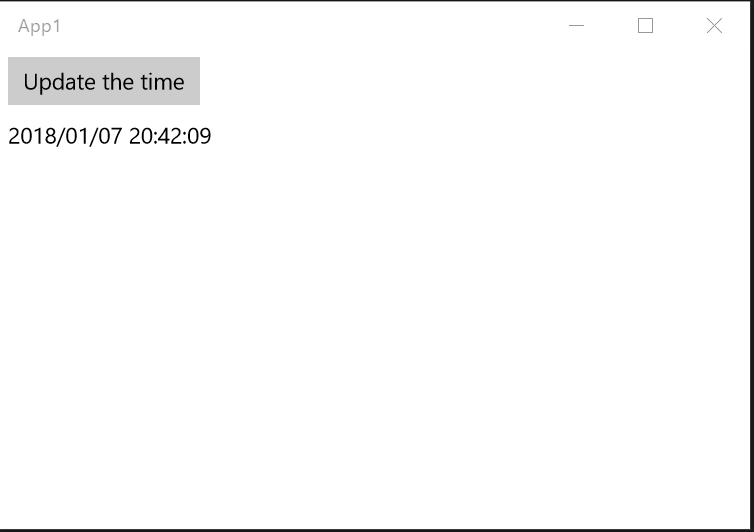
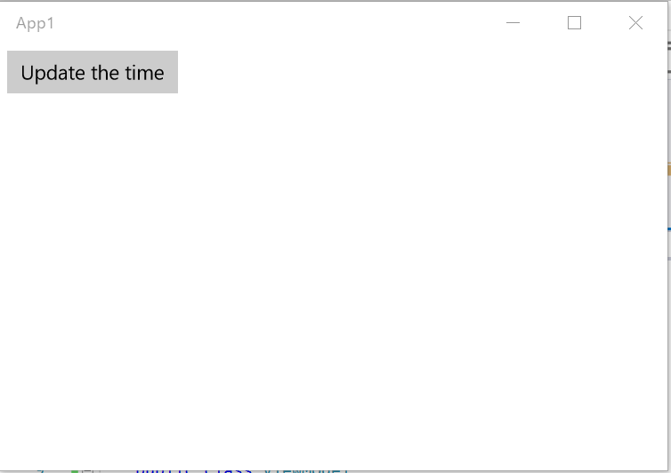

# ReactiveCommand class

This class implements following two interfaces.
- ICommand interface
- IObservable&lt;T&gt;

## Basic usage

This class can be created using the ToReactiveCommand extension method from IObservable&lt;bool&gt; instance.
When the IObservable&lt;bool&gt; instance updated, the CanExecuteChanged event raise.

If you want an always executable command, then you can create ReactiveCommand instance using the default constructor.

```cs
IObservable<bool> canExecuteSource = ...;

ReactiveCommand someCommand = canExecuteSource.ToReactiveCommand(); // non command parameter version.
ReactiveCommand<string> hasCommandParameterCommand = canExecuteSource.ToReactiveCommand<string>(); // has command parameter version
ReactiveCommand alwaysExecutableCommand = new ReactiveCommand(); // non command parameter and always can execute version.
ReactiveCommand<string> alwaysExecutableAndHasCommandParameterCommand = new ReactiveCommand<string>(); // has command parameter and always can execute version.
```

And you can set the initial return value of CanExecute method using factory extension method's initalValue argument.
The default value is true.

```cs
IObservable<bool> canExecuteSource = ...;

ReactiveCommand someCommand = canExecuteSource.ToReactiveCommand(false);
ReactiveCommand<string> hasCommandParameterCommand = canExecuteSource.ToReactiveCommand<string>(false);
```

When the Execute method is called, ReactiveCommand call an OnNext callback.
You can register the execute logic using the Subscribe method.

```cs
ReactiveCommand someCommand = new ReactiveCommand();
someCommand.Subscribe(_ => { ... some logic ... }); // set an OnNext callback

someCommand.Execute(); // OnNext callback is called.
```

## Using in the ViewModel class

The first example, just use a ReactiveCommand class.

```cs
public class ViewModel
{
    public ReactiveCommand UpdateTimeCommand { get; }

    public ReactiveProperty<string> Time { get; }

    public ViewModel()
    {
        Time = new ReactiveProperty<string>();
        UpdateTimeCommand = new ReactiveCommand();
        UpdateTimeCommand.Subscribe(_ => Time.Value = DateTime.Now.ToString("yyyy/MM/dd HH:mm:ss"));
    }
}
```

The UWP platform example.

```cs
public sealed partial class MainPage : Page
{
    private ViewModel ViewModel { get; } = new ViewModel();
    public MainPage()
    {
        this.InitializeComponent();
    }
}
```

```xml
<Page x:Class="App1.MainPage"
      xmlns="http://schemas.microsoft.com/winfx/2006/xaml/presentation"
      xmlns:x="http://schemas.microsoft.com/winfx/2006/xaml"
      xmlns:local="using:App1"
      xmlns:d="http://schemas.microsoft.com/expression/blend/2008"
      xmlns:mc="http://schemas.openxmlformats.org/markup-compatibility/2006"
      mc:Ignorable="d">
    <StackPanel Background="{ThemeResource ApplicationPageBackgroundThemeBrush}">
        <Button Content="Update the time"
                Command="{x:Bind ViewModel.UpdateTimeCommand}"
                Margin="5" />
        <TextBlock Text="{x:Bind ViewModel.Time.Value, Mode=OneWay}"
                   Style="{ThemeResource BodyTextBlockStyle}"
                   Margin="5" />
    </StackPanel>
</Page>
```



## Work with LINQ

The ReactiveCommand class implements IObservable&lt;T&gt; interface. 
Can use LINQ methods, and the ReactiveProperty&lt;T&gt; class can create from an IObservable&lt;T&gt;.
Yes, can change the previous example code to the below.

```cs
public class ViewModel
{
    public ReactiveCommand UpdateTimeCommand { get; }

    // Don't need that set the Value property. So can change to the ReadOnlyReactiveProperty.
    public ReadOnlyReactiveProperty<string> Time { get; }

    public ViewModel()
    {
        UpdateTimeCommand = new ReactiveCommand();
        Time = UpdateTimeCommand
            .Select(_ => DateTime.Now.ToString("yyyy/MM/dd HH:mm:ss"))
            .ToReadOnlyReactiveProperty();
    }
}
```

## Create from IObservable&lt;bool&gt;

Change to that the UpdateTimeCommand don't invoke during 5 secs after the command invoked.

```cs
public class ViewModel
{
    public ReactiveCommand UpdateTimeCommand { get; }

    public ReadOnlyReactiveProperty<string> Time { get; }

    public ViewModel()
    {
        var updateTimeTrigger = new Subject<Unit>();
        UpdateTimeCommand = Observable.Merge(
            updateTimeTrigger.Select(_ => false),
            updateTimeTrigger.Delay(TimeSpan.FromSeconds(5)).Select(_ => true))
            .ToReactiveCommand();
        Time = UpdateTimeCommand
            .Select(_ => DateTime.Now.ToString("yyyy/MM/dd HH:mm:ss"))
            .Do(_ => updateTimeTrigger.OnNext(Unit.Default))
            .ToReadOnlyReactiveProperty();
    }
}
```



## Create a command and subscribe, in one statement

In the case that doesn't use LINQ methods, can create a command and subscribe, in one statement.
The WithSubscribe extension method subscribe and return the ReactiveCommand instance, see below.

```cs
public class ViewModel
{
    public ReactiveCommand UpdateTimeCommand { get; }

    public ReactiveProperty<string> Time { get; }

    public ViewModel()
    {
        Time = new ReactiveProperty<string>();

        var updateTimeTrigger = new Subject<Unit>();
        UpdateTimeCommand = Observable.Merge(
            updateTimeTrigger.Select(_ => false),
            updateTimeTrigger.Delay(TimeSpan.FromSeconds(5)).Select(_ => true))
            .ToReactiveCommand()
            .WithSubscribe(() => Time.Value = DateTime.Now.ToString("yyyy/MM/dd HH:mm:ss")); // here
    }
}
```

This is a just shortcut the below code.

```cs
// No use the WithSubscribe
var command = new ReactiveCommand();
command.Subscribe(_ => { ... some actions ... });

// Use the WithSubscribe
var command = new ReactiveCommand()
    .WithSubscribe(() => { ... some actions ... });
```

If use LINQ methods, then separate statements create an instance and subscribe an onNext.

## Unsubscribe actions

If need that unsubscribes actions, then use the Dispose method of IDisposable which Subscribe method returned.

```cs
var command = new ReactiveCommand();
var subscription1 = command.Subscribe(_ => { ... some actions ... });
var subscription2 = command.Subscribe(_ => { ... some actions ... });

// Unsubscribe per Subscribe method.
subscription1.Dispose();
subscription2.Dispose();

// Unsubscribe all
command.Dispose();
```

The WithSubscribe extension method have override methods which have IDisposable argument.

```cs
IDisposable subscription = null;
var command = new ReactiveCommand().WithSubscribe(() => { ... some action ... }, out subscription);

// Unsubscribe
subscription.Dispose();
```

And has an override of Action<IDisposable> argument.
It is used together with the CompositeDisposable class.

```cs
var subscriptions = new CompositeDisposable();
var command = new ReactiveCommand()
    .WithSubscribe(() => { ... some actions ... }, subscriptions.Add)
    .WithSubscribe(() => { ... some actions ... }, subscriptions.Add);

// Unsubscribe
subscription.Dispose();
```

In other instance's events subscribe, then you should call the Dispose method of the ReactiveCommand class when the end of ViewModel lifecycle.
