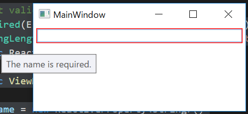
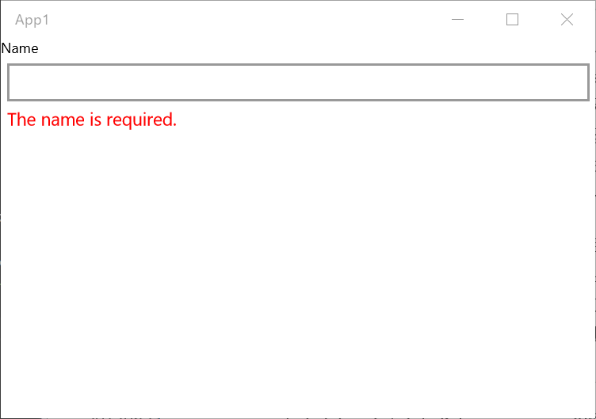
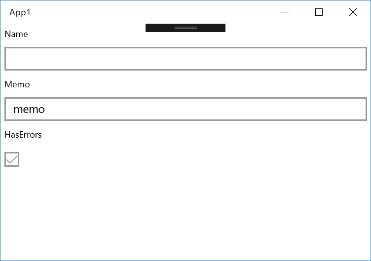
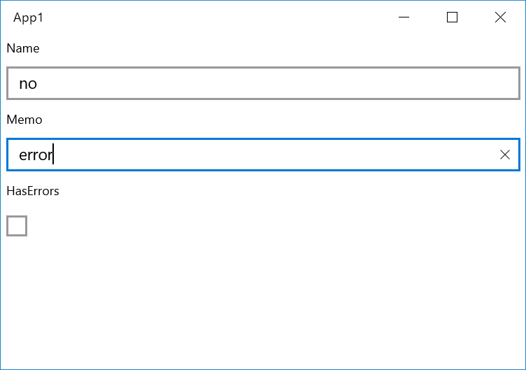

# ReactiveProperty

ReactiveProperty is core class of this library.
This has following features.

- Implements the INotifyPropretyChanged interface.
    - The value property raise the PropertyChanged event.
- Implements the IObservable&lt;T&gt; interface.

Yes, The value property can bind to XAML control's property.
And the class call the IObserver&lt;T&gt;#OnNext method when set the value.

A sample code is below.

```cs
using Reactive.Bindings;
using System;

namespace ReactivePropertyEduApp
{
    class Program
    {
        static void Main(string[] args)
        {
            // create from defualt constructor(default value is null)
            var name = new ReactiveProperty<string>();
            // setup the event handler and the onNext callback.
            name.PropertyChanged += (_, e) => Console.WriteLine($"PropertyChanged: {e.PropertyName}");
            name.Subscribe(x => Console.WriteLine($"OnNext: {x}"));

            // update the value property.
            name.Value = "neuecc";
            name.Value = "xin9le";
            name.Value = "okazuki";
        }
    }
}
```

The output of this program is below.

```
OnNext:
OnNext: neuecc
PropertyChanged: Value
OnNext: xin9le
PropertyChanged: Value
OnNext: okazuki
PropertyChanged: Value
```

What's deferent between PropertyChanged and onNext callback?
The onNext is called when subscribe. The PropertyChanged isn't called when added the event handler. And the onNext callback's argument is the property value, the PropertyChanged argument don't have the property value.

The PropertyChanged event was provided for data binding. In the normal case, you should use Reactive Extensions methods.

## Use with XAML platform

The ReactiveProperty class is designed for XAML platform which is like WPF, UWP, and Xamarin.Forms.
This class can be used a ViewModel layer. 

In the case that don't use the ReactiveProperty, a ViewModel class wrote below. 

```cs
public class MainPageViewModel : INotifyPropertyChanged
{
    public event PropertyChangedEventHandler PropertyChanged;

    private string _name;
    public string Name
    {
        get => _name;
        set
        {
            _name = value;
            PropertyChanged?.Invoke(this, new PropertyChangedEventArgs(nameof(Name)));
        }
    }

    // Other properties are defined similar codes.
}
```

And those properties binds in the XAML code.

```xml
<!-- In the WPF -->
<TextBox Text="{Binding Name}" />

<!-- In the UWP(Runtime data binding) -->
<TextBox Text="{Binding Name}" />

<!-- In the UWP(Compile time data binding) -->
<TextBox Text="{x:Bind ViewModel.Name, Mode=TwoWay}" />

<!-- In the Xamarin.Forms -->
<Entry Text="{Binding Name}" />
```

In the case that uses the ReactiveProperty, a ViewModel code becomes very simple!

```cs
// The INotifyPropertyChanged interface must implement when using the WPF.
// Because, if you don't implement this, then memory leak occurred.
public class MainPageViewModel
{
    public ReactiveProperty<string> Name { get; } = new ReactiveProperty<string>();

    // Other properties are defined similar codes.
}
```

When binding in the XAML code, you must add the `.Value` in binding path.
This is an only limitation of this library.

```xml
<!-- In the WPF -->
<TextBox Text="{Binding Name.Value}" />

<!-- In the UWP(Runtime data binding) -->
<TextBox Text="{Binding Name}.Value" />

<!-- In the UWP(Compile time data binding) -->
<TextBox Text="{x:Bind ViewModel.Name.Value, Mode=TwoWay}" />

<!-- In the Xamarin.Forms -->
<Entry Text="{Binding Name.Value}" />
```

> We forget the `.Value` sometimes. If you have a ReSharper license, then you can use this plugin.
> [ReactiveProperty XAML Binding Corrector](https://resharper-plugins.jetbrains.com/packages/ReSharper.RpCorrector/)
> Highlight the missing of ReactiveProperty ".Value" in XAML.

## How to create a ReactiveProperty instance

The ReactiveProperty class can create from many methods.

### Create from the constructor

The simplest way is that using constructor.

```cs
// create with the default value.
var name = new ReactiveProperty<string>();
Console.WriteLine(name.Value); // -> empty output

// create with the initial value.
var name = new ReactiveProperty<string>("okazuki");
Console.WriteLine(name.Value); // -> okazuki
```

### Create from IObservable&lt;T&gt;

This can create from IObservable&lt;T&gt;.
Just calls `ToReactiveProperty` method.

```cs
IObservable<long> observableInstance = Observable.Interval(TimeSpan.FromSeconds(1));

// Convert to ReactiveProperty from IObservable.
ReactiveProperty<long> counter = observableInstance.ToReactiveProperty();
```

#### Create from ReactiveProperty

The ReactiveProperty implements IObservable interface.
It means that ReactiveProperty can be created from ReactiveProperty.

```cs
var name = new ReactiveProperty<string>("");

var formalName = name.Select(x => $"Dear {x}")
    .ToReactiveProperty();
```

All IObservable instances can become ReactiveProperty. 

## Validation

The ReactiveProperty class implements INotifyDataErrorInfo interface.

### Set custom validation logics

You can set custom validation logic using the SetValidateNotifyError method.

```cs
var name = new ReactiveProperty<string>()
    .SetValidateNotifyError(x => string.IsNullOrWhiteSpace(x) ? "Error message" : null);
```

In the correct value case, validation logic should return null.
In invalid value case, logic should return an error message.

### Work with DataAnnotations

This class can work together with the DataAnnotations.
You can set validation attribute using the SetValidateAttribute method.

```cs
class ViewModel
{
    // Set validation attributes
    [Required(ErrorMessage = "The name is required.")]
    [StringLength(100, ErrorMessage = "The name length should be lower than 30.")]
    public ReactiveProperty<string> Name { get; }

    public ViewModel()
    {
        Name = new ReactiveProperty<string>()
            // Set validation attributes into the ReactiveProperty.
            .SetValidateAttribute(() => Name);
    }
}
```

WPF is integrated INotifyDataErrorInfo interface. See below.



### Handling validation errors

Another platform can't display error messages from the INofityDataErrorInfo interface.
ReactiveProperty class have some properties for handling validation errors.

A first property is `ObserveErrorChanged`.
This type is `IObservable<IEnumerable>`. You can convert to an error message from IEnumerable. See below.

```cs
class ViewModel
{
    // Set validation attributes
    [Required(ErrorMessage = "The name is required.")]
    [StringLength(100, ErrorMessage = "The name length should be lower than 30.")]
    public ReactiveProperty<string> Name { get; }

    public ReactiveProperty<string> NameErrorMessage { get; }

    public ViewModel()
    {
        Name = new ReactiveProperty<string>()
            // Set validation attributes into the ReactiveProperty.
            .SetValidateAttribute(() => Name);

        // Handling an error message
        NameErrorMessage = Name.ObserveErrorChanged
            .Select(x => x?.OfType<string>()?.FirstOrDefault())
            .ToReactiveProperty();
    }
}
```

Bind `NameErrorMessage.Value` property to a text control. An error message can be displayed.

In the case of UWP, see below.

```cs
public sealed partial class MainPage : Page
{
    private ViewModel ViewModel { get; } = new ViewModel();
    public MainPage()
    {
        this.InitializeComponent();
    }
}
```

```xml
<Page x:Class="App1.MainPage"
      xmlns="http://schemas.microsoft.com/winfx/2006/xaml/presentation"
      xmlns:x="http://schemas.microsoft.com/winfx/2006/xaml"
      xmlns:local="using:App1"
      xmlns:d="http://schemas.microsoft.com/expression/blend/2008"
      xmlns:mc="http://schemas.openxmlformats.org/markup-compatibility/2006"
      mc:Ignorable="d">
    <StackPanel Background="{ThemeResource ApplicationPageBackgroundThemeBrush}">
        <TextBlock Text="Name"
                   Style="{ThemeResource CaptionTextBlockStyle}" />
        <TextBox Text="{x:Bind ViewModel.Name.Value, Mode=TwoWay, UpdateSourceTrigger=PropertyChanged}"
                 Margin="5" />
        <TextBlock Text="{x:Bind ViewModel.NameErrorMessage.Value, Mode=OneWay}"
                   Foreground="Red"
                   Margin="5,0"
                   Style="{ThemeResource BodyTextBlockStyle}" />
    </StackPanel>
</Page>
```



Next property is `ObserveHasErrors`. `ObserveHasErrors` property type is `IObservable<bool>`.
In popular input form case, combine `ObserveHasErrors` property values very useful.

This sample program is that create HasErros property that type is ReactiveProperty&lt;bool&gt; that combine two ReactiveProperty's ObserveHasErrors properties.

```cs
public class ViewModel
{
    // Set validation attributes
    [Required(ErrorMessage = "The name is required.")]
    [StringLength(100, ErrorMessage = "The name length should be lower than 30.")]
    public ReactiveProperty<string> Name { get; }

    [Required(ErrorMessage = "The memo is required.")]
    public ReactiveProperty<string> Memo { get; }

    public ReactiveProperty<bool> HasErrors { get; }

    public ViewModel()
    {
        Name = new ReactiveProperty<string>()
            .SetValidateAttribute(() => Name);

        Memo = new ReactiveProperty<string>()
            .SetValidateAttribute(() => Memo);

        // You can combine some ObserveHasErrors values.
        HasErrors = new[]
            {
                Name.ObserveHasErrors,
                Memo.ObserveHasErrors,
            }.CombineLatest(x => x.Any(y => y))
            .ToReactiveProperty();
    }
}
```

```xml
<Page x:Class="App1.MainPage"
      xmlns="http://schemas.microsoft.com/winfx/2006/xaml/presentation"
      xmlns:x="http://schemas.microsoft.com/winfx/2006/xaml"
      xmlns:local="using:App1"
      xmlns:d="http://schemas.microsoft.com/expression/blend/2008"
      xmlns:mc="http://schemas.openxmlformats.org/markup-compatibility/2006"
      mc:Ignorable="d">
    <StackPanel Background="{ThemeResource ApplicationPageBackgroundThemeBrush}">
        <TextBlock Text="Name"
                   Style="{ThemeResource CaptionTextBlockStyle}" 
                   Margin="5" />
        <TextBox Text="{x:Bind ViewModel.Name.Value, Mode=TwoWay, UpdateSourceTrigger=PropertyChanged}"
                 Margin="5" />
        <TextBlock Text="Memo"
                   Style="{ThemeResource CaptionTextBlockStyle}"
                   Margin="5" />
        <TextBox Text="{x:Bind ViewModel.Memo.Value, Mode=TwoWay, UpdateSourceTrigger=PropertyChanged}"
                 Margin="5" />
        <TextBlock Text="HasErrors"
                   Style="{ThemeResource CaptionTextBlockStyle}"
                   Margin="5" />
        <CheckBox IsChecked="{x:Bind ViewModel.HasErrors.Value, Mode=OneWay}"
                  IsEnabled="False"
                  Margin="5" />
    </StackPanel>
</Page>
```





Last property is `HasErrors`. It is a just bool property.

```cs
public class ViewModel
{
    // Set validation attributes
    [Required(ErrorMessage = "The name is required.")]
    [StringLength(100, ErrorMessage = "The name length should be lower than 30.")]
    public ReactiveProperty<string> Name { get; }

    public ViewModel()
    {
        Name = new ReactiveProperty<string>()
            .SetValidateAttribute(() => Name);
    }

    public void DoSomething()
    {
        if (Name.HasErrors)
        {
            // invalid value case
        }
        else
        {
            // valid value case
        }
    }
}
```

### Don't need initial validation error

In default behavior, ReactiveProperty report errors when validation logic set.
If you don't need initial validation error, then you can skip the error.
Just call Skip method.

```cs
class ViewModel
{
    // Set validation attributes
    [Required(ErrorMessage = "The name is required.")]
    [StringLength(100, ErrorMessage = "The name length should be lower than 30.")]
    public ReactiveProperty<string> Name { get; }

    public ReactiveProperty<string> NameErrorMessage { get; }

    public ViewModel()
    {
        Name = new ReactiveProperty<string>()
            .SetValidateAttribute(() => Name);

        // Handling an error message
        NameErrorMessage = Name.ObserveErrorChanged
            .Skip(1) // Skip the first error.
            .Select(x => x?.OfType<string>()?.FirstOrDefault())
            .ToReactiveProperty();
    }
}
```

## The mode of ReactiveProperty

ReactiveProperty class call OnNext callback when Subscribe method called.

```cs
var x = new ReactiveProperty<string>("initial value");
x.Subscribe(x => Console.WriteLine(x)); // -> initial value
```

You could change this behavior when ReactiveProperty instance create.
Constructor and ToReactiveProperty method have mode argument.
This can be set following values.

- ReactivePropertyMode.None
    - ReactiveProperty doesn't call OnNext callback when Subscribe method call. And call OnNext callback if the same value set.
- ReactivePropertyMode.DistinctUntilChanged
    - This doesn't call OnNext callback if same value set.
- ReactivePropertyMode.RaiseLatestValueOnSubscribe
    - This calls OnNext callback when Subscribe method call.

Default value is `ReactivePropertyMode.DistinctUntilChanged | ReactivePropertyMode.RaiseLatestValueOnSubscribe`.

If you don't need this behavior, then you can set ReactivePropertyMode.None value.

```cs
var x = new ReactiveProperty<string>("initial value", mode: ReactivePropertyMode.None);
x.Subscribe(x => Console.WriteLine(x)); // -> don't output value
x.Value = "initial value"; // -> initial value
```

## ReadOnlyReactiveProperty class

If you never set Value property, then you can use ReadOnlyReactiveProperty class.
This class can't set the property, and other behavior is same ReactiveProperty class.
ReadOnlyReactiveProperty class is created from ToReadOnlyReactiveProperty extension method.

See below.

```cs
public class ViewModel
{
    public ReactiveProperty<string> Input { get; }

    // Output never set value.
    public ReadOnlyReactiveProperty<string> Output { get; }

    public ViewModel()
    {
        Input = new ReactiveProperty<string>("");
        Output = Input
            .Delay(TimeSpan.FromSeconds(1))
            .Select(x => x.ToUpper())
            .ToReadOnlyReactiveProperty(); // convert to ReadOnlyReactiveProperty
    }
}
```

## Unsubscribe

ReactiveProperty class implements IDisposable interface.
When Dispose method called, ReactiveProperty class releases all subscription.
In other instance's events subscribe, then you should call Dispose method when the end of ViewModel lifecycle.

```cs
public class ViewModel : IDisposable
{
    public ReadOnlyReactiveProperty<string> Time { get; }

    public ViewModel()
    {
        Time = Observable.Interval(TimeSpan.FromSeconds(1))
            .Select(_ => DateTime.Now.ToString("yyyy/MM/dd HH:mm:ss"))
            .ToReadOnlyReactiveProperty();
    }

    public void Dispose()
    {
        // Unsbscribe
        Time.Dispose();
    }
}
```

